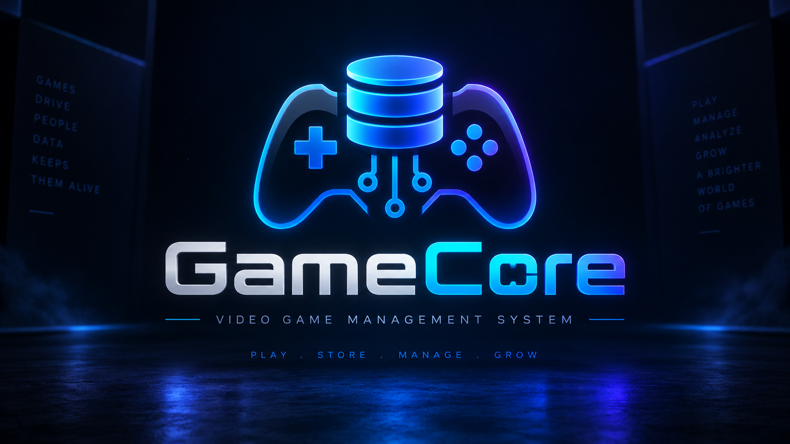

<div align="center">



<br/>


**Video Game Management System**

Sistema full stack para administrar el ecosistema operativo de una empresa de videojuegos: **catálogo, clientes, ventas, empleados, distribución y analítica**, construido como restauración moderna de un proyecto académico de bases de datos.

<p>
  
  
  
  
</p>

<a href="https://github.com/Jairo0811/GameCore/actions/workflows/ci.yml">
  
</a>

<br/><br/>

**PLAY · STORE · MANAGE · GROW**

</div>

---

## 🎮 ¿Qué es GameCore?

**GameCore** es una aplicación de gestión orientada a una empresa que desarrolla, administra o distribuye videojuegos.

Su objetivo es centralizar información del negocio y convertirla en operaciones reales dentro de una misma plataforma:

- 🎮 administración del catálogo de videojuegos;
- 🧩 géneros, plataformas y clasificaciones;
- 👥 gestión de clientes;
- 🧾 registro de ventas y detalle de productos;
- 👨‍💼 administración de empleados, cargos y sucursales;
- 🌎 distribución de videojuegos por país;
- 📊 dashboard con indicadores y rendimiento comercial;
- 🗄️ consultas y reporting respaldados directamente por SQL Server.

GameCore **no pretende ser un POS de tienda tradicional**. Aunque registra ventas, su foco está en administrar el ecosistema de la empresa y sus datos, no en funciones de caja como turnos de cajero, arqueos o inventario físico detallado.

---

## ✨ Funcionalidades principales

| Módulo | Función |
|---|---|
| 📊 **Dashboard** | KPIs de videojuegos, clientes, ventas, empleados, ingresos y títulos más vendidos |
| 🎮 **Videojuegos** | Alta, edición, desactivación y consulta del catálogo |
| 🧩 **Catálogos** | Géneros, plataformas y clasificaciones por edad |
| 👥 **Clientes** | Registro y actualización de clientes |
| 🧾 **Ventas** | Ventas transaccionales con múltiples videojuegos por operación |
| 👨‍💼 **Empleados** | Personal, sucursales, cargos y estado |
| 🌎 **Distribución** | Distribución de títulos por países y cantidades |
| 📈 **Reportes** | Ventas mensuales, rendimiento por juego, valor por cliente y distribución geográfica |
| 🔐 **Autenticación** | Acceso protegido mediante JWT |
| 🧪 **SQL avanzado** | Views, stored procedures, funciones, transacciones y reporting |

---

## 🏗️ Arquitectura

```text
┌─────────────────────────────┐
│ React + TypeScript + Vite   │
│        Frontend Web         │
└──────────────┬──────────────┘
               │ HTTP / JSON
               ▼
┌─────────────────────────────┐
│ ASP.NET Core Web API        │
│ JWT · Endpoints REST        │
└──────────────┬──────────────┘
               │
               ▼
┌─────────────────────────────┐
│ Domain                      │
│ Application                 │
│ Infrastructure              │
└──────────────┬──────────────┘
               │ Entity Framework Core
               ▼
┌─────────────────────────────┐
│ GameCoreDB · SQL Server     │
│ Tables · Views · SP · UDF   │
└─────────────────────────────┘
```

La restauración mantiene un enfoque **database-first**: los scripts de `database/` siguen siendo la fuente principal del esquema y Entity Framework Core mapea la base existente.

---

## 🧱 Stack tecnológico

### Frontend

- **React 19**
- **TypeScript**
- **Vite**
- interfaz responsive
- cliente HTTP autenticado mediante Bearer Token
- identidad visual GameCore integrada

### Backend

- **.NET 10**
- **ASP.NET Core Web API**
- **C#**
- **Entity Framework Core**
- **JWT Bearer Authentication**
- separación por capas:
  - `GameCore.Domain`
  - `GameCore.Application`
  - `GameCore.Infrastructure`
  - `GameCore.WebAPI`

### Base de datos

- **Microsoft SQL Server**
- claves primarias y foráneas
- restricciones `CHECK` y `UNIQUE`
- índices
- views
- stored procedures
- funciones escalares
- transacciones
- `OPENJSON`
- reporting SQL

### DevOps / calidad

- **Docker**
- **Docker Compose**
- **GitHub Actions**
- chequeo de vulnerabilidades NuGet
- `npm audit`
- smoke test en PowerShell

---

## 🗄️ Modelo de datos

El modelo moderno amplía el diseño académico original y separa correctamente las responsabilidades principales:

```text
Companies
 └── Branches
      └── Employees
           └── JobPositions

Games
 ├── AgeRatings
 ├── GameGenres ── Genres
 ├── GamePlatforms ── Platforms
 └── Distributions ── Countries

Customers
 └── Sales
      └── SaleDetails
           └── Games

AppUsers
 └── JWT Authentication
```

Una de las mejoras fundamentales respecto al modelo original fue reemplazar:

```text
Cliente → Videojuego
```

por:

```text
Cliente → Venta → Detalle de Venta → Videojuego
```

Esto permite que un cliente tenga múltiples compras y que una venta contenga múltiples videojuegos.

---

## 🔌 API

La API expone recursos protegidos bajo `/api`.

### Autenticación

```text
POST /api/auth/login
```

### Recursos principales

```text
GET    /api/games
POST   /api/games
PUT    /api/games/{id}
DELETE /api/games/{id}

GET    /api/customers
POST   /api/customers
PUT    /api/customers/{id}

GET    /api/sales
POST   /api/sales

GET    /api/employees
POST   /api/employees

GET    /api/distributions
POST   /api/distributions

GET    /api/catalogs
GET    /api/dashboard
GET    /api/reports
```

La creación de ventas se ejecuta de forma transaccional para evitar operaciones parciales.

---

## 🗂️ Estructura del repositorio

```text
GameCore/
├── database/
│   ├── advanced/
│   │   ├── functions.sql
│   │   ├── procedures.sql
│   │   ├── reports.sql
│   │   ├── validate.sql
│   │   └── views.sql
│   ├── schema.sql
│   ├── seed.sql
│   ├── security.sql
│   ├── setup.sql
│   ├── reset.sql
│   └── validate.sql
│
├── src/
│   ├── backend/
│   │   ├── GameCore.Domain/
│   │   ├── GameCore.Application/
│   │   ├── GameCore.Infrastructure/
│   │   ├── GameCore.WebAPI/
│   │   └── GameCore.sln
│   │
│   └── frontend/
│       ├── public/brand/
│       └── src/
│
├── docs/
│   ├── original/
│   ├── database/
│   └── RELEASE.md
│
├── scripts/
│   └── smoke-test.ps1
│
├── Dockerfile.backend
├── Dockerfile.frontend
├── docker-compose.yml
└── README.md
```

---

## 🎨 Identidad visual

La identidad de GameCore combina los dos conceptos centrales del proyecto:

- 🎮 **mando de videojuegos** → industria y catálogo;
- 🗄️ **base de datos** → origen académico y núcleo de información.

Los assets utilizados por la aplicación están incluidos en:

```text
src/frontend/public/brand/
├── gamecore-logo.png
└── gamecore-icon.svg
```

El isotipo también funciona como favicon de la aplicación.

---

## 🎓 Origen académico

GameCore nació como proyecto final de **Introducción a las Bases de Datos (SOF-006)** en el **Instituto Tecnológico de Las Américas (ITLA)**.

| Información | Detalle |
|---|---|
| 🏫 Institución | **Instituto Tecnológico de Las Américas (ITLA)** |
| 📖 Asignatura | **Introducción a las Bases de Datos (SOF-006)** |
| 👨‍🏫 Profesor | **Freidy Ramón Núñez Pérez** |
| 📅 Período académico | **2016-C2** |
| 👨🏻‍💻 Estudiante | **Francis Jairo Matías Rosario — 2015-2984** |
| 📁 Entrega original | **Proyecto Final** |
| 🛠️ Restauración | **2026** |

La versión original se concentraba en:

- creación de tablas;
- claves primarias y foráneas;
- `INSERT`;
- filtros;
- `JOIN`;
- consultas básicas en SQL Server.

El archivo histórico se conserva en:

```text
docs/original/TAREA-FINAL.sql
```

Ese código **no fue reescrito para ocultar sus limitaciones**. Se conserva como evidencia del proyecto inicial y la versión moderna vive de forma separada para mostrar claramente la evolución técnica.

---

## 🔄 Evolución del proyecto

```text
Proyecto académico SOF-006
          ↓
Modelo relacional + SQL Server
          ↓
Rediseño de base de datos
          ↓
SQL Server Core
          ↓
Advanced SQL
          ↓
.NET 10 + EF Core
          ↓
REST API + JWT
          ↓
React + TypeScript
          ↓
GameCore
```

### Fases de restauración

| # | Fase | Estado |
|---:|---|:---:|
| 0 | Legacy Preservation | ✅ |
| 1 | Database Redesign | ✅ |
| 2 | SQL Server Core | ✅ |
| 3 | Advanced SQL | ✅ |
| 4 | .NET Foundation | ✅ |
| 5 | REST API | ✅ |
| 6 | React Foundation | ✅ |
| 7 | Game Management | ✅ |
| 8 | Customers & Sales | ✅ |
| 9 | Employees & Distribution | ✅ |
| 10 | Dashboard & Reports | ✅ |
| 11 | Security & Validation | ✅ |
| 12 | Portfolio Hardening | ✅ |
| 13 | Release 1.0 implementation | ✅ |

---

## 🚀 Ejecución local

### 1. Base de datos

Desde la raíz del repositorio:

```powershell
sqlcmd -S localhost -E -f 65001 -i database/setup.sql
```

El script instala:

- esquema;
- seed de demostración;
- seguridad;
- views;
- funciones;
- stored procedures;
- validaciones.

### 2. Backend

```powershell
dotnet restore src/backend/GameCore.sln
dotnet build src/backend/GameCore.sln -c Release
dotnet run --project src/backend/GameCore.WebAPI/GameCore.WebAPI.csproj
```

API local predeterminada:

```text
http://localhost:5152
```

### 3. Frontend

```powershell
cd src/frontend
npm install
npm run dev
```

Frontend local:

```text
http://localhost:5173
```

---

## 🔑 Cuenta de demostración

```text
Email:    admin@gamecore.local
Password: GameCore123!
```

> Las credenciales demo y la clave JWT incluida en configuración son exclusivamente para desarrollo local. Deben cambiarse antes de cualquier despliegue real.

---

## 🐳 Docker

El repositorio incluye configuración para backend, frontend y SQL Server:

```powershell
docker compose up --build
```

---

## 🧪 Validación

Antes de etiquetar la versión final se deben ejecutar:

```powershell
dotnet build src/backend/GameCore.sln -c Release
dotnet list src/backend/GameCore.sln package --vulnerable --include-transitive
```

y en el frontend:

```powershell
cd src/frontend
npm install
npm run build
npm audit --audit-level=high
```

También se incluye:

```text
scripts/smoke-test.ps1
```

La lista completa está documentada en `docs/RELEASE.md`.

---

## 🔒 Privacidad y preservación

Los datos personales presentes en el artefacto académico original se conservan únicamente como parte del contexto histórico del proyecto.

La aplicación moderna utiliza **datos de demostración anonimizados** y no reutiliza identificadores personales reales como seed operativo.

---

## 📌 Estado

**Implementación funcional completada.**

La etiqueta definitiva `v1.0.0` se reserva hasta terminar la validación runtime local completa de:

- SQL Server;
- backend .NET;
- frontend React;
- autenticación;
- módulos funcionales;
- smoke test;
- auditorías de dependencias.

---

<div align="center">

### GameCore

**Del modelo relacional a una aplicación full stack.**

PLAY · STORE · MANAGE · GROW

</div>
