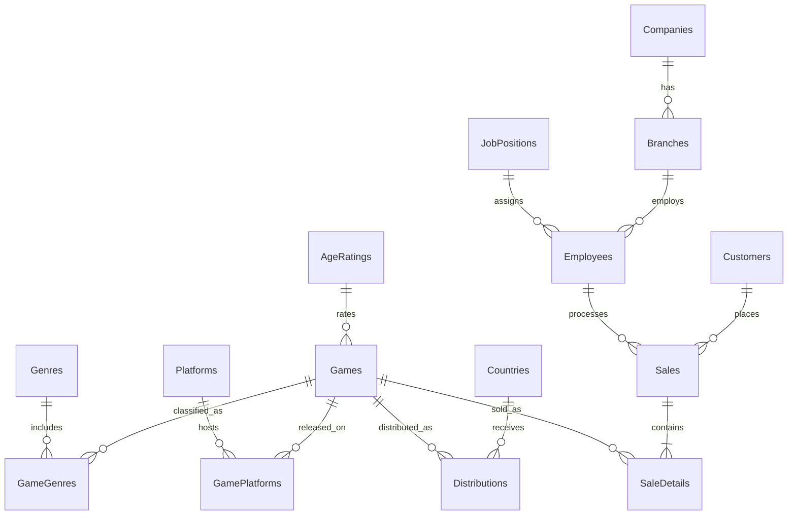

# GameCore relational model



## Core relationship correction

The legacy model effectively used:

```text
Customer -> Game
```

GameCore uses:

```text
Customer -> Sale -> SaleDetail -> Game
```

This supports multiple purchases per customer and multiple games per sale.
